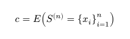
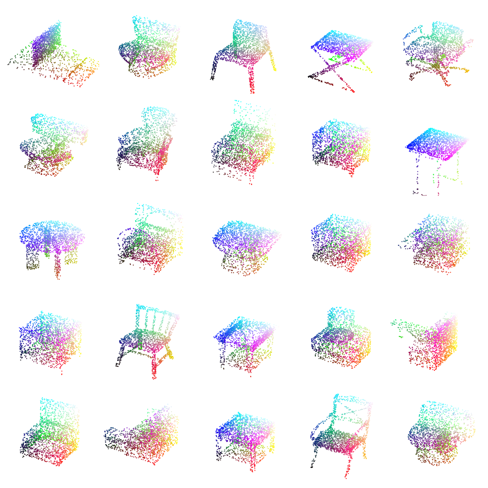
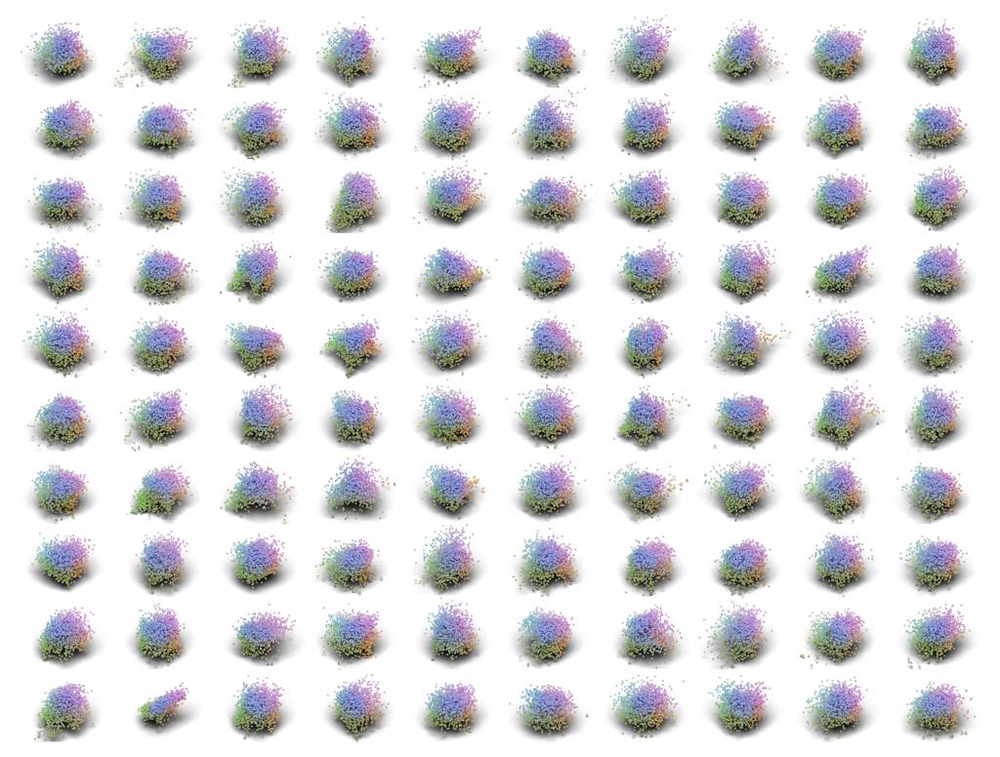
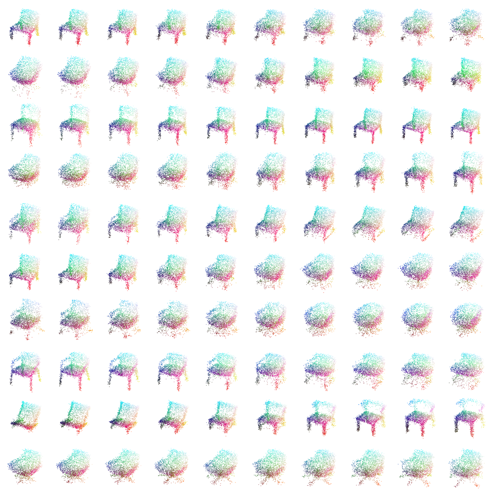

# Context-Aware Flow Matching

Authors: Lars Kühmichel

## This site is a work in progress. Please check back later.

[GitHub Repository](https://github.com/LarsKue/context-aware-flow-matching)

[GitHub Pages Project Page](https://larskue.github.io/context-aware-flow-matching/)

This repository contains parts of the code used in my master's thesis, titled
"Advancements in Context-Aware Learning and Generative Modeling".

## 1. Introduction

Our approach to context-aware learning is defined in the thesis as
deep learning using an embedding from a set of context inputs:

<div align="center">
    
</div>


In this repo, we use [Optimal Transport Flow Matching](https://arxiv.org/abs/2302.00482) to leverage this
embedding and learn a  generative model that can be conditioned on sampled
context embeddings, thus enabling interpolation between contexts:

<div align="center">
    
</div>

## 2. Install

Create a new conda environment with the required dependencies:
```bash
conda env create -f env.yaml
```

Activate the environment:
```bash
conda activate context-aware-flow-matching
```

Verify your install by running pytest:
```bash
pytest tests -m "not slow"
```

If you want to plot samples using blender, install the blender env instead:

```bash
conda env create -f blender.yaml
```

Activate and verify as above.

Note that these environments are incompatible with each other,
because they each require different python versions.

## 3. Experiments

Experiment notebooks can be found in the `experiments` folder. We use
[Lightning-Trainable](https://github.com/LarsKue/lightning-trainable)
to train our models. Each notebook contains the hyperparameters used for training.

### 3.1 ModelNet10

**Dataset:** [ModelNet10](https://3dvision.princeton.edu/projects/2014/3DShapeNets/)

<div align="center">
    
    
    

    Left: Samples from the dataset. Middle: Model Reconstructions. Right: Samples from the trained model.
</div>

<div align="center">
    

    Linear interpolation between randomly sampled contextual embeddings.
</div>

<div align="center">
    

    Rotating points in the latent space of the flow helps visualize the shape manifold.
</div>

<div align="center">
    

    Evaluation metrics on the test set. The model is competitive with other state-of-the-art approaches.
</div>


### 3.2 LIDAR-CS (WIP)

**Dataset:** [LIDAR-CS](https://github.com/LiDAR-Perception/LiDAR-CS)

Left: Samples from the dataset. Right: Samples from the trained model.

<div align="center">
    
    
    
    
    Left: Samples from the dataset. Middle: Model Reconstructions. Right: Samples from the trained model.
</div>


<div align="center">
    

    Samples from the test set of the LIDAR-CS dataset, which were marked as out-of-distribution by the model.
</div>


<div class="row">
    
    
    Evaluation metrics on the test set. The model is competitive with other state-of-the-art approaches.
</div>


## 4. References

See my thesis: [Advancements in Context-Aware Learning and Generative Modeling](docs/thesis.pdf)
