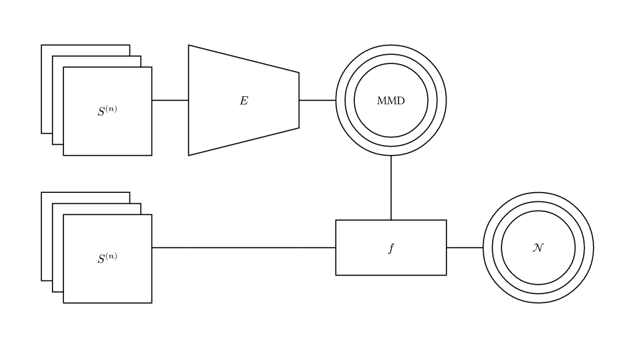
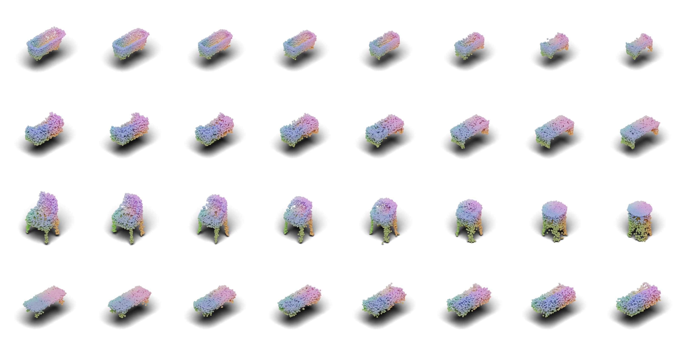

# Context-Aware Flow Matching

This repository contains parts of the code used in my master's thesis titled "[TBD]".

## 1. Introduction

Context-Aware learning is defined in the thesis as deep learning using an embedding from a set of
context inputs:

<p align="center">
    
</p>


In this repo, we use [OT Flow Matching](https://arxiv.org/abs/2302.00482) to leverage this embedding and learn a
generative model that can be conditioned on sampled context embeddings, thus enabling interpolation
between contexts:

<p align="center">
    
</p>

## 2. Install

### 2.1 Using Conda

Create a new environment with the required dependencies:
```bash
conda env create -f env.yaml
```

Activate the environment:
```bash
conda activate context-aware-flow-matching
```

Verify your install by running pytest:
```bash
pytest tests -m "not slow"
```

If you want to plot samples using blender, install the blender env instead:

```bash
conda env create -f blender.yaml
```

## 3. Experiments

Experiment notebooks can be found in the `experiments` folder. We use
[Lightning-Trainable](https://github.com/LarsKue/lightning-trainable)
to train our models. Each notebook contains the hyperparameters used for training.

### 3.1 ModelNet10

Dataset: [ModelNet10](https://3dvision.princeton.edu/projects/2014/3DShapeNets/)

Samples from the trained model:

<p align="center">
    
</p>

We can interpolate between contexts:

<p align="center">
    
</p>

The shape manifold is particularly visible when we rotate points in the latent space:

<p align="center">
    <video width="500" autoplay loop playsinline>
        <source src="docs/modelnet10/rotation.mp4" type="video/mp4">
        Your browser does not support the video tag.
    </video>
</p>
